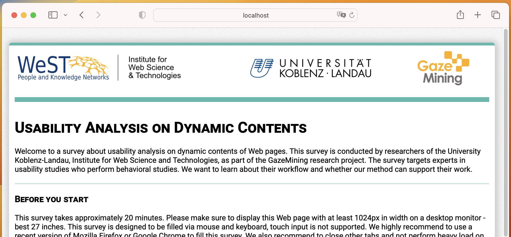

# Expert Survey about Visual Stimuli Discovery
Survey to understand the usefullnes of visual stimuli discovery to experts in usability analysis. Part of the [GazeMining](https://gazemining.de/index_en.html) research project.

⚠️ The survey has been completed. This repository is for archival purposes, only.

## Setup
Bases on the [Survey Framework](https://github.com/Institute-Web-Science-and-Technologies/survey-framework). See the instructions of that repository for local and server setup.

## Analysis
The results of the survey and analysis with an IPython Notebook thereof is stored under [analysis](./analysis).

## License
>Copyright 2024 Raphael Menges
>
>Permission is hereby granted, free of charge, to any person obtaining a copy of this software and associated documentation files (the "Software"), to deal in the Software without restriction, including without limitation the rights to use, copy, modify, merge, publish, distribute, sublicense, and/or sell copies of the Software, and to permit persons to whom the Software is furnished to do so, subject to the following conditions:
>
>The above copyright notice and this permission notice shall be included in all copies or substantial portions of the Software.
>
>THE SOFTWARE IS PROVIDED "AS IS", WITHOUT WARRANTY OF ANY KIND, EXPRESS OR IMPLIED, INCLUDING BUT NOT LIMITED TO THE WARRANTIES OF MERCHANTABILITY, FITNESS FOR A PARTICULAR PURPOSE AND NONINFRINGEMENT. IN NO EVENT SHALL THE AUTHORS OR COPYRIGHT HOLDERS BE LIABLE FOR ANY CLAIM, DAMAGES OR OTHER LIABILITY, WHETHER IN AN ACTION OF CONTRACT, TORT OR OTHERWISE, ARISING FROM, OUT OF OR IN CONNECTION WITH THE SOFTWARE OR THE USE OR OTHER DEALINGS IN THE SOFTWARE.

## Acknowledgment
We acknowledge the financial support by the Federal Ministry of Education and Research of Germany under the project number 01IS17095B.
